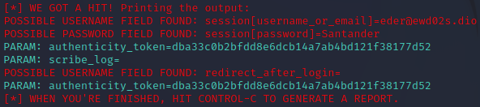

# Phishing para captura de senhas

### Ferramentas

- Kali Linux
- setoolkit

### Configurando o Phishing no Kali Linux

- Acesso root: ``` sudo su ```
- Iniciando o setoolkit: ``` setoolkit ```
- Tipo de ataque: ``` 1. Social-Engineering Attacks ```
- Vetor de ataque: ``` 2. Web Site Attack Vectors ```
- Método de ataque: ```3. Credential Harvester Attack Method ```
- Método de ataque: ``` 1. Web Templates ```
- Obtendo o endereço da máquina: ``` ifconfig ```
- Web Templates para clone: ``` 3. Twitter ```

### Resutados


